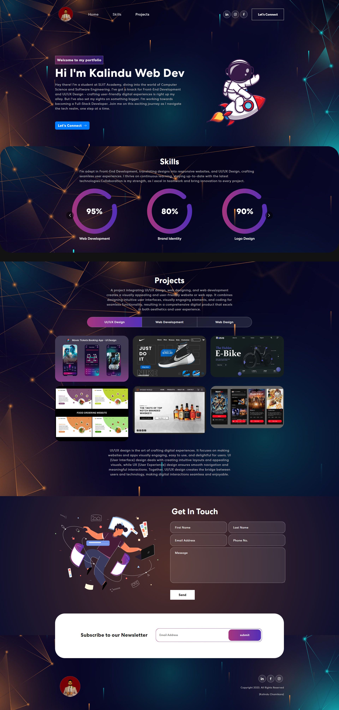

# Kalindu Chathuranga's Personal Portfolio




Welcome to my personal portfolio website built with React, JavaScript, HTML, and CSS.

## Table of Contents

- [About](#about)
- [Demo](#demo)
- [Technologies Used](#technologies-used)
- [Installation](#installation)
- [Usage](#usage)
- [Contributing](#contributing)
- [License](#license)

## About

This portfolio showcases my skills, projects, and experiences as a software developer. It serves as a central hub for anyone interested in learning more about me and my work.

## Demo

You can visit my portfolio website here: [Portfolio Link](insert_demo_link_here)


## Technologies Used

- React: A JavaScript library for building user interfaces.
- JavaScript: The primary programming language used for interactivity.
- HTML: For structuring the content of the website.
- CSS: For styling and layout design.

## Installation

To run this portfolio website locally, follow these steps:

1. Clone the GitHub repository:

   ```bash
   git clone https://github.com/KalinduCh/Responsive-Portfollio---React.git
